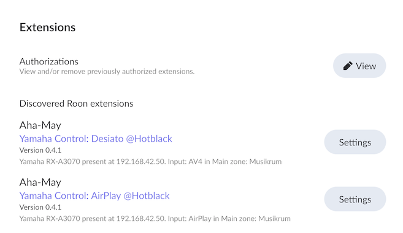
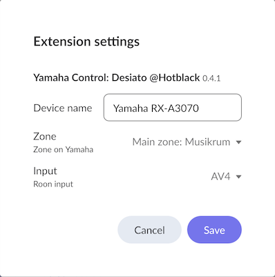

# roon-extension-yamaha

roon-extension-yamaha is a extension to Roon to support for Yamaha receivers to be controlled from within Roon. The extension can control zone, input, volume, mute and standby.

</br>
*Screenshot of roon extension settings*

</br>
*Screenshot of roon-extension-yamaha running in roon*

## Manual Installation

1. Install node.js
   * macOS: install homebrew http://homebrew.sh
   * Linux: according to installation procedure at https://nodejs.org
   * Windows: according to installation procedure at https://nodejs.org

1. Create a folder for the extension files
   ``<local_folder>/<path>/roon-extension-yamaha``
1. Download the files ``app.js``, ``yxc_api_cmd_modified.js`` and ``package.json`` to the folder
1. Install the modules and dependencies used by the extension

   ```bash
   npm install
   ```

1. run the extension

   ```bash
   node app.js
   ```

   Optional addition: An identification tag can be added in the extension settings in Roon

   ```bash
   node app.js MyID
   ```

## Intallation using Docker

Docker images are available at [Docker Hub](https://hub.docker.com/r/42henrik/roon-extension-yamaha) and the stable image can be pulled by:
``docker pull 42henrik/roon-extension-yamaha:stable``

Start the docker by running:

```
docker run -d \
  --name your-roon-extension-yamaha-name \
  --volume /<local_folder>/<path>/roon-extension-yamaha/:app\
  --env ID="MyID" \
  --network=host \
  --restart=always \
  42henrik/roon-extension-yamaha:stable 
```

Following docker options are optional:
| Option | Description |
| :----- | :---------- |
| --env ID="MyID" | Adds an identification tag shown in the Roon extension settings. It allows you to distinguish the extensions in case you run several instances |
| --volume | Path to the local folder on host where files, dependent modules and Roon config.json file will be stored. |

## Tested devices

The extension has been tested on a Yamaha RX-A3070, but a broader support of Yamaha receivers are expected.

The roon-extension-yamaha is built on **Yamaha Extended Control (YXC) API Specification (Basic)**, rev 1.x, published 2016, hence the extension should possibly work with receivers manufactured 2016 and later.

## Known limitation

The extension will search for Yamaha receivers on your network at the first launch and it will present the first one that appear. If there are several receivers connected to the network you should bring them up one by one. After it has identified the receiver it saves its IP address. To avoid network scans for receivers; you could either configure the receiver with a static adress *or* register your receivers' MAC adress in your DHCP server/router.

## Version history

* 2024-04-08: initial release
* 2024-05-13: initial release based on YXC specification

## Acknowledgements and thanks

* foxthefox/yamaha-yxc-nodejs for the YXC node implementation. The roon-extension-yamaha uses a modified .js file to adapt to Roon extension.
* statesofpop/roon-yamaha for the inspiration
* Yamaha for their YXC specification.
</br>

> ❗ **Note:** The *roon-extension-yamaha* is not affiliated to Yamaha Corporation.
